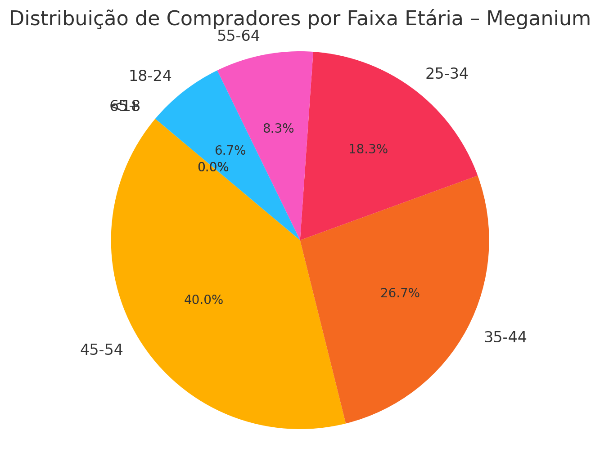

# 🌐 Estratégias de Expansão Global – Meganium

**Data de criação:** 2025-07-30  
**Análise baseada em dados reais de vendas internacionais (Shopee, Etsy, AliExpress)**

---

## 🎯 Objetivo

Este documento apresenta estratégias para a **diversificação internacional da marca Meganium**, com base na análise das vendas consolidadas. Também destaca as **faixas etárias mais relevantes** para segmentação de marketing e desenvolvimento de novos produtos.

---

## 📊 Distribuição por Faixa Etária

A seguir, temos o gráfico que mostra a proporção dos compradores da Meganium por faixa etária:

> **Observações:**
> - O público de **45–54 anos** é o mais expressivo.
> - Faixas entre **25 e 44 anos** também possuem alto índice de consumo.
> - Público jovem (18–24) apresenta ticket médio elevado, mesmo com menor volume.

---

## 🧠 Estratégias de Diversificação Global

Com base na análise dos dados, sugerem-se as seguintes estratégias para internacionalização e fortalecimento da marca:

### 1. **Foco em Público de 35 a 54 anos**
- São os principais consumidores da linha atual.
- Investir em design retrô e nostálgico, com campanhas emocionais.
- Desenvolver bundles ou edições limitadas exclusivas para esse público.

### 2. **Segmentação Jovem (18–24) com Alto Ticket Médio**
- Apesar de menor volume, o gasto médio é elevado.
- Estratégia digital com forte presença em redes sociais (TikTok, YouTube Shorts).
- Parcerias com streamers, gamers e influenciadores de nicho.

### 3. **Expansão por Continente**
| Região        | Ação Estratégica                                  |
|---------------|---------------------------------------------------|
| América do Norte | Fortalecer distribuição via Amazon e Walmart    |
| Europa         | Tradução e localização completa do e-commerce    |
| Ásia           | Parcerias com marketplaces locais (Rakuten, etc) |
| Oceania        | Fortalecer frete e suporte pós-venda             |

### 4. **Personalização de Produto por Região**
- Identificar modelos mais vendidos por país e oferecer skins, idiomas e conteúdos específicos.
- Ex: versão japonesa com menu em kanji, fonte retrô e design adaptado.

---

## 📌 Conclusão

A Meganium está bem posicionada para expandir internacionalmente, com uma base sólida em faixas etárias economicamente ativas. Com foco estratégico e segmentado por faixa etária e localização, a marca pode se tornar referência global em tecnologia retrô e inovação nostálgica.

---

## 📁 Arquivos

- `distribuicao_faixa_etaria.png`: gráfico de pizza da distribuição etária.
- `estrategia_mercado_meganium.md`: este arquivo.

---

## © Meganium Global Strategy – 2025
